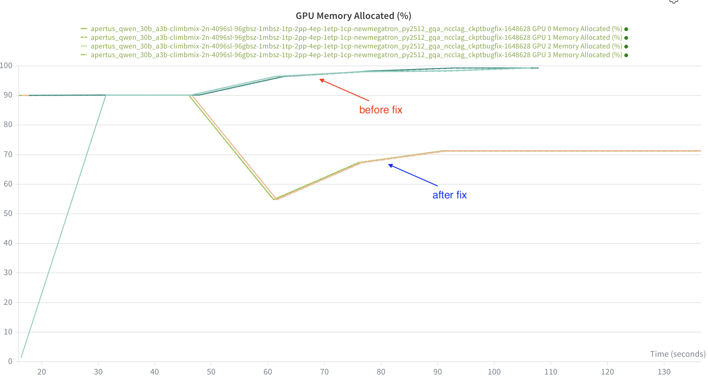
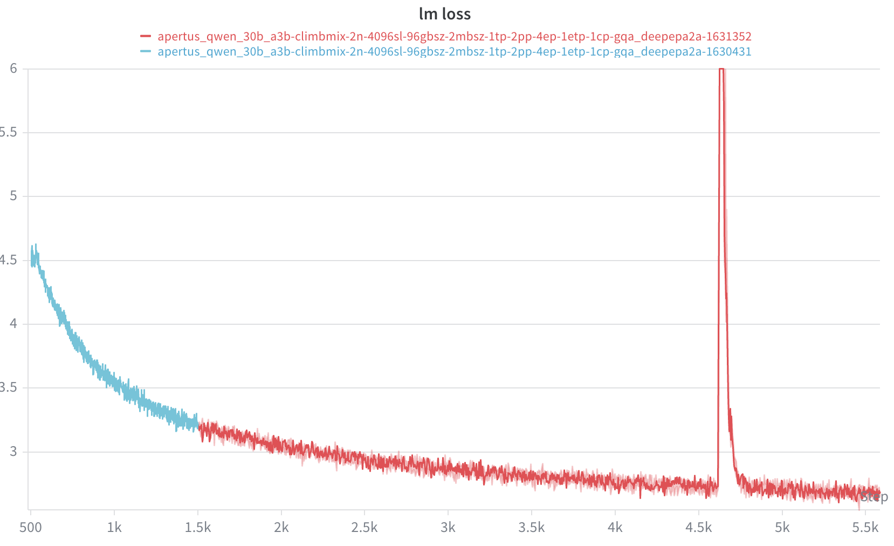

# Baseline MoE Model Experiments

Documentations for first step baseline MoE model experiments.

**===========================**

**DEPRECATED**

**===========================**

## 13/03 Qwen-30B-A3B baseline MoE model

- **Setup**: 8GPUs, TP1PP2EP4DP4
- **Iteration**: ~9k
- **Consumed token**: ~3.5B
- **Throughput**: ~160 TLOPs/GPU


- Stable and presents no loss spike. 

## 12/03 Ckpt loading failure in Megatron

> - **Megatron**: https://github.com/NVIDIA/Megatron-LM/tree/core_v0.16.0, [https://github.com/swiss-ai/Megatron-LM/tree/merge-260109](https://github.com/swiss-ai/Megatron-LM/tree/merge-260109)
> - **Problems:** 
>   There are 2 problems
>   1. When `--precision-aware-optimizer` is enabled, this version of Megatron will save Optimizer States with an additional bool field `padding`. However in`megatron/core/optimizer/distrib_optimizer.py`, the function `_set_main_param_and_optimizer_states` expects `tensors` to contains only 3 fields. But what the saved tensor has an extra field called `padding` which is a bool type, and it causes error in when calling `set_scaled_state` because `padding` is not a tensor.
>   2. When loading optimizer states from checkpoints, the memory cost is unexpectedly large and could cause OOM.
>
> - **Solutions:**
>   1. Either use `dev` branch in Megatron, or skip `padding` field manually in `_set_main_param_and_optimizer_states`
>   2. For OOM: https://github.com/NVIDIA/Megatron-LM/pull/3558

After fix, the checkpoint loading works without OOM. And the memory trace is normal:



## 11/03 Baseline MoE Model Experiments cont'd

> Due to the problem encountered with swiss-ai codebase:
>
> 1. Checkpoints loading failure
> 2. A loss spike in this small model
>
> I switched to:
>
> - **Megatron** community version: https://github.com/NVIDIA/Megatron-LM/tree/core_v0.16.0
> - **Alps3 Image**: jfrog.svc.cscs.ch/docker-group-csstaff/alps-images/ngc-pytorch:25.12-py3-alps3
> - **NCCL All-gather** for EP communication

- **Trial**: https://wandb.ai/fuguan323-ethz/apertus_qwen_30b_a3b_climbmix/runs/pfowa53u

- Loss looks fine without spike. Present minor deviation from previous run.

  

- Throughput improves a bit: 135 to 168 TFLOPs/GPU
  - The performance gain is purely due to use AllGather instead of AlltoAll
- To be tested if the spike problem can be reproduced

## 09/03 Baseline MoE Model Experiments

#### Exp1

> - **Megatron commit**: [https://github.com/swiss-ai/Megatron-LM/tree/merge-260109](https://github.com/swiss-ai/Megatron-LM/tree/merge-260109)
> - **Model:** qwen3_30b_a3b, first 3 layers as dense layer
> - **Dataset:** `/iopsstor/scratch/cscs/gfu/datasets/climbmix/hftokenized`
>
> - **Image**: `/iopsstor/scratch/cscs/gfu/ce-images/megatron_deepep-aarch64.sqsh`
> - **Parallel Strategy**: DP4EP4PP2TP1, 8GPUs
> - **Training Config**: GBS96, MBS2, GA12

- **Trial:** https://wandb.ai/fuguan323-ethz/apertus_qwen_30b_a3b_climbmix?nw=nwuserfuguan323

- **Problem**: stops at iter 999 due to misconfiguration of `--eval-interval` and `--data-split`
  - disable evaluation for current experiments

#### Exp2 Cont'd

> - Same config as Exp1, **loading checkpoints ar iter 500.**
>
> - add `--no-load-optim` as **optimizer state loading fails**. No idea why.
> - disable evaluation iter

- **Trial**: https://wandb.ai/fuguan323-ethz/apertus_qwen_30b_a3b_climbmix/runs/lor75f4n?nw=nwuserfuguan323

- **Consumed token**: ~2B

- **Checkpoints**: `/iopsstor/scratch/cscs/gfu/megatron-runs/apertus_qwen_30b_a3b_climbmix/apertus_qwen_30b_a3b-climbmix-2n-4096sl-96gbsz-2mbsz-1tp-2pp-4ep-1etp-1cp-gqa_deepepa2a/checkpoints`

- **Note**: there is a spike at 4.6k iter.

  

## 07/03 Baseline MoE Model Experiments OOM

> - **Megatron commit**: [https://github.com/swiss-ai/Megatron-LM/tree/merge-260109](https://github.com/swiss-ai/Megatron-LM/tree/merge-260109)
> - **Model:** qwen3_30b_a3b, first 3 layers as dense layer
> - **Dataset:** `/iopsstor/scratch/cscs/gfu/datasets/climbmix/hftokenized`
>
> - **Image**: `/iopsstor/scratch/cscs/gfu/ce-images/megatron_deepep-aarch64.sqsh`
> - **Parallel Strategy**: DP2EP2PP4TP1, 8GPUs
> - **Training Config**: GBS96, MBS4, GA12

- **Trail**: https://wandb.ai/fuguan323-ethz/apertus_qwen_30b_a3b_nemotron

- **Problem:** OOM after ~55 steps, reproducible

  - High memory pressure for gpu2 and gpu3

  - ***Could be the results of load imbalance in MoE layer***


## 05/03 Reference Baseline MoE Model

### Model

- **Qwen3-30B-A3B**
  
    ```json
    {
      "attention_bias": false,
      "attention_dropout": 0.0,
      **"head_dim": 128,**
      **"hidden_size": 2048,**
      "initializer_range": 0.02,
      **"intermediate_size": 6144,**
      "max_position_embeddings": 40960,
      **"moe_intermediate_size": 768,**
      "norm_topk_prob": true,
      **"num_hidden_layers": 48,**
      **"num_attention_heads": 32,
      "num_key_value_heads": 4,**
      **"num_experts": 128,**
      **"num_experts_per_tok": 8,
      "optimizer": "adam", # ademamix
      "act": "swiglu"**
    }
    ```
    
    - traditional GQA (4/32)
    - standard MoE sparsity (8/128)
    - reasonable model size

### Setup and Scripts

- **Megatron Recipe**: [link](https://docs.nvidia.com/nemo/megatron-bridge/latest/models/llm/qwen.html#id6)
- **Num of Node: 2**
- **Parallel Strategy and Estimated Memory per GPU**
    - PP4-EP2-DP2-TP1
    - GBS = 96
    - MBS = 4
    - GA = 12
    - SeqLen = 4096
    - Theoretical = 99150.76 MB (99.1GB)
        - Weight + optimizer = 44.18GB
        - Activation = 54.97GB
        - MoE activation recompute
        
        ```
        6: [Rank 6] (after 2 iterations) memory (MB) | allocated: 53199.095703125 | **max allocated: 84019.3681640625** | reserved: 84732.0 | max reserved: 84732.0
        2: [Rank 2] (after 2 iterations) memory (MB) | allocated: 50314.07666015625 | **max allocated: 81835.0830078125** | reserved: 82324.0 | max reserved: 82324.0
        4: [Rank 4] (after 2 iterations) memory (MB) | allocated: 50317.25390625 | **max allocated: 71306.03662109375** | reserved: 71744.0 | max reserved: 71744.0
        ```
    
- **Sbatch Script**: `/users/gfu/frameworks/Megatron-LM-sai/myscripts/apertus_qwen_30b_a3b_baseline.sh`

## 03/03 Draft model experiment

A draft model to make the experiment running and check:

- [x] deepep
- model config

	{
	  "head_dim": 128,
	  "hidden_size": 2048,
	  "intermediate_size": 6144,
	  "moe_intermediate_size": 768,
	  "num_hidden_layers": 5,
	  "num_attention_heads": 32,
	  "num_key_value_heads": 4,
	  "num_experts": 64,
	  "num_experts_per_tok": 8,
	  "act": "swiglu"
	}