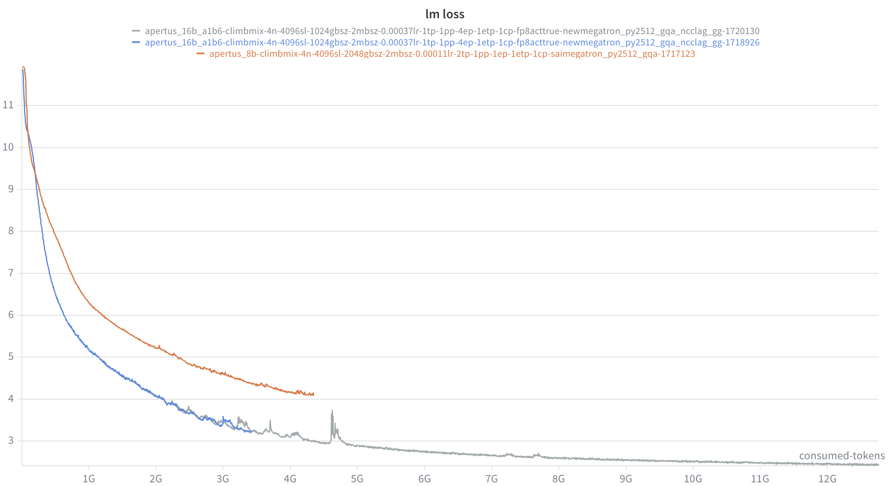

# Dense to MoE model ablation experiments

The baseline MoE experiments with Qwen3-30B-A3B is kind of in a mess due to all kinds of problems in Megatron and the low training throughputs. Also, it is not so clear for me how should we utilize this baseline model. Hence, I want to slightly switch the gear with the following roadmap:

- **For the original Qwen3-30B-A3B experiments:**

  - Continue the experiment but with a focus more on the performance side. 

- **For the exploration of MoE model:**

  I want to follow the prior works to understand and verify the scaling law for MoE models. 

  - A dense model (Apertus -8B or Qwen3-8B). The dense model will be used to verify the MFU/loss.
  - A comparable MoE model using the scaling law from the prior work. The MoE model will be configured carefully, and to see if it can surpass the dense baseline. 

## Theoratical analysis

1. Define MoE vs Dense in terms of FLOPs

2. MoE consumes less computation while maintains a larger model size

3. Given a 8B dense model size, when will a MoE model surpass it?

   - **Comparison Criteria**

     - LM loss: should be the easiest to observe.
     - Downstream task

   - **Fixed compute budget $C$:** 

     
     $$
     \begin{align}
     & M = 6\Phi_{comp}\\
     & C = M\cdot D
     \end{align}
     $$
     

     where $\Phi_{comp}$ is the parameter size that involved in computation, $M$ is the computational cost per token and $D$ is the number of tokens. A typical approach in ablations woule be using a fixed compute budget for MoE and dense models. Assume a **fixed compute budget of $10^{21}$ FLOPs**, with 8B dense model and 30B-A3B MoE model. We have the following estimations:

     - $D_{dense} = \frac{10^{21}}{6\cdot8e9} = 21B$, $D_{moe} = \frac{10^{21}}{6\cdot3e9} = 56B$

   - **Fixed wall time $T$:** 

     The calculations above give approximations based on fixed $C$. In practice, even though MoE requires lower computations, the throughput does not match expecations. By testing, we have practical token throughputs given 16GPUs for 8B dense model and 30B-A3B MoE model: 

     - $t_{dense} = 99620\ \rm{tokens/s}$, $t_{moe} = 137600\ \rm{tokens/s}$
     - $T_{dense} = \frac{21B}{99260} = 58h$, $T_{moe} = \frac{56B}{137600}=113h$

     As we can see, MoE model requires almost twice of the training time using our current training framework compared to the dense model given the same compute budget. It matches the MFU observed: ~$41$% for dense and ~$20$% for MoE. Then what if we **fix the training wall time $T$ to 12h:**

     - $C_{dense}= 6\cdot 8e9\cdot t_{dense} \cdot 12h$ = $2\cdot 10^{20}$ FLOPs, $C_{moe} = 6\cdot 3e9 \cdot t_{moe} \cdot 12h$ = $10^{20}$ FLOPs
     - $D_{dense} = 4.2B$, $D_{moe} = 5.6B$

## Dense to MoE experiments

Prior work declares that: *an MoE model with a 3.1% activation ratio and an expert granularity of 12 will achieve over 7x computational efficiency under a 1e22 FLOPs compute budget*. 

#### Setup

- **Dense model**: 
  - Apertus-8B with SwiGLU and Adam ([link](https://github.com/swiss-ai/pretrain-code/blob/main/pretraining/submit_apertus_8b.sh))
  - 16 nodes, GBS2048, TP2, LR1.1e-4

- **MoE model**: 

  ```
  --num-layers 20
  --hidden-size 2048
  --ffn-hidden-size 5120
  --moe-ffn-hidden-size 512
  --moe-shared-expert-intermediate-size 512
  --num-experts 256
  --moe-router-topk 12
  --ep 4
  --mbs 2
  --seql 4096
  ```

  - 16B-1.6B with SwiGLU and Adam, Non-embd Activated parameter = 1.07B
  - $A = \frac{12 + 1}{256} = 5.1\%$, $G = \frac{2\cdot 2048}{512} = 8$
  - 16 nodes, GBS1024, EP4, LR3.3e-4

- **Compute Budget**

  - $\frac{M_{dense}}{M_{moe}} = 5$, it is less than the declaration but should be good for verification
  - If we fix $C = 10^{21}$FLOPs: 
    - $D_{dense} = 21B$, $D_{moe} = 104B$
    - $T_{dense} = \frac{21B}{99260} = 58h$, $T_{moe} = \frac{104B}{300800}=96h$
  - If we fix $T = 12h$
    - $C_{dense} $ = $2\cdot 10^{20}$ FLOPs, $C_{moe} = 6\cdot 1.6e9 \cdot 300800 \cdot 12h$ = $1.2\cdot 10^{20}$ FLOPs
    - $D_{dense} = 4.2B$, $D_{moe} = 12.5B$

- **What to expect?**

  Given the current settings, we want to see: 

  - Will MoE model's loss surpass Dense model?
  - If so, can this MoE model do better in loss?
  - Otherwise, how to modify the MoE model?

#### Experiments

- After the first 12h:

