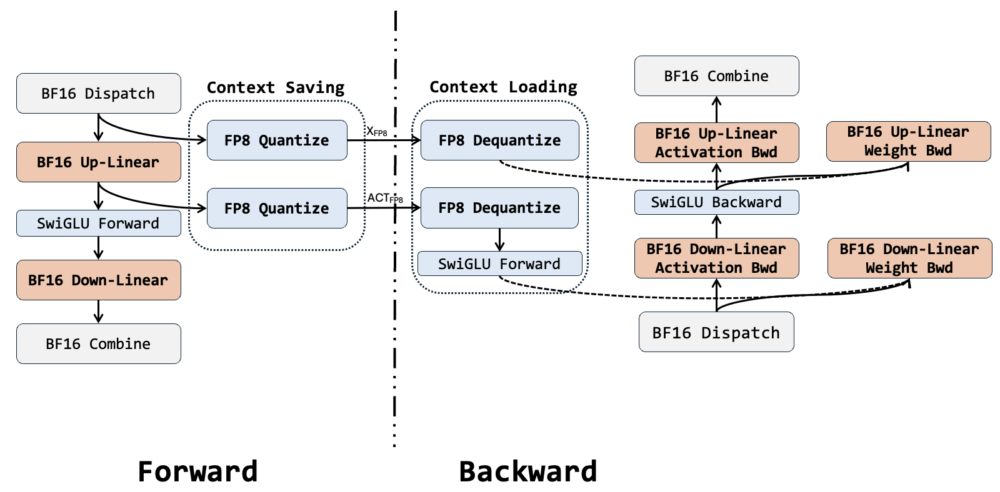
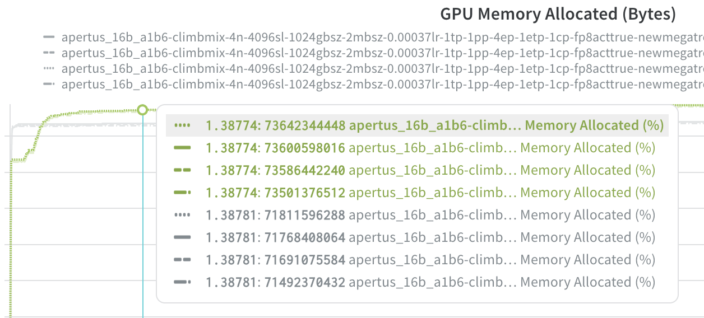
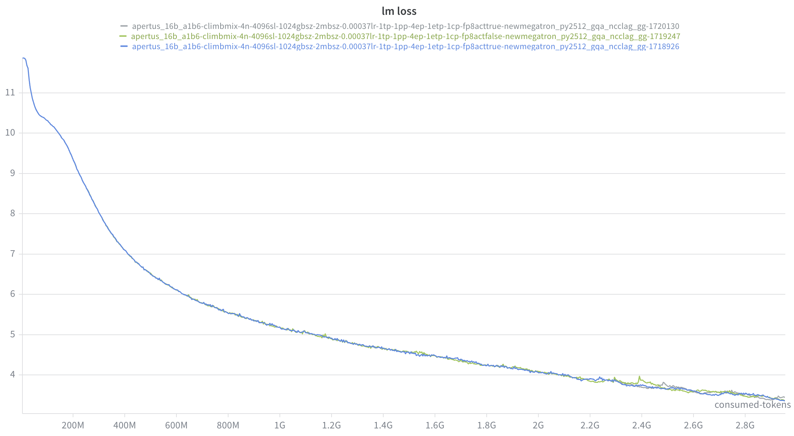

# Performance for MoE training

Documentation for performance optimization for MoE training.

## 1. FP8 activation storage

Following Kimi-2, we can adopt FP8 storage for insensitive activations: Inputs of MoE up-projections and SwiGLU can be compressed to FP8-E4M3 in 1× 128 tiles with FP32 scales.

##### Design

- Save activation memory for backward pass
  - Manually implement autograd function
  - Call TE quantization for context saving
  - Call TE dequantization for context loading



##### Implementation 

- https://github.com/FFGGSSJJ/Megatron-LM/commit/f921902ab7489ca7f2c6abba77ca69aaf504b04a

##### Verification

- **Throughput**
  - Almost zero throughput drop

- **Memory saving**

  - Tested with 16B-A1.6B MoE model

    ```
    --num-layers 20
    --hidden-size 2048
    --ffn-hidden-size 5120
    --moe-ffn-hidden-size 512
    --moe-shared-expert-intermediate-size 512
    --num-experts 256
    --moe-router-topk 12
    --ep 4
    --mbs 2
    --seql 4096
    ```

  - MoE layer activation memory estimation:
    - Assume balance routing: $\frac{2\cdot 4096 \cdot 12}{256} =384$ tokens/expert
    - $size_{x,bf16} = 384 \cdot \frac{256}{4} \cdot 2048\cdot 2Byte =1.8GB$, $size_{x, fp8} = 0.9GB$
    - $size_{a,bf16} = 384 \cdot \frac{256}{4} \cdot (512\cdot 2)\cdot 2Byte =0.9GB$, $size_{a,bf16} = 0.45GB$
    - ~1.3GB can be saved. By testing, it matches expectation:

​	

- **Loss accuracy**
  - On 3B tokens, didn't see obvious deviations

​	

## 2. Mock Router

To build the idea of how well our framework can perform, we should simulate the scenario where tokens are routed to experts in a balance manner. 

##### Design

Mock router is for performance inspection. The idea is to manipulate logit in router to simulate balance scenario:

- $logit = 10^{-12} \cdot logit + \rm{torch.normal(0, 1)}$

##### Implementation

- https://github.com/FFGGSSJJ/Megatron-LM/commit/b3179d189320e3e7518b344247e06e29624cfd6d

##### Verification

- Throughput stays stable after 3 steps.


